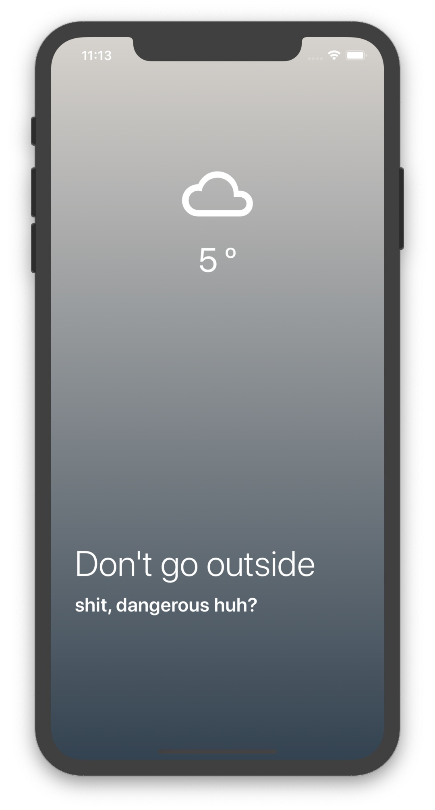

# Weather Application with React Native

|         Clear Weather          |         Cloud Weather          |         Dust Weather          |
| :----------------------------: | :----------------------------: | :---------------------------: |
|  |  |  |

|         Drizzle Weather          |         haze Weather          |         Mist Weather          |
| :------------------------------: | :---------------------------: | :---------------------------: |
|  |  |  |

|         Rain Weather          |         Snow Weather          |         Thunder Weather          |
| :---------------------------: | :---------------------------: | :------------------------------: |
|  |  |  |

## Features

- Build and Test with React Native from Expo
- CrossPlatform Application On Android / IOS
- Get a client location and Show the weather there - Location Api by Expo
- Show the weather get from OpenWeather Api - Weather get from [openWeather-Api](https://openweathermap.org)
