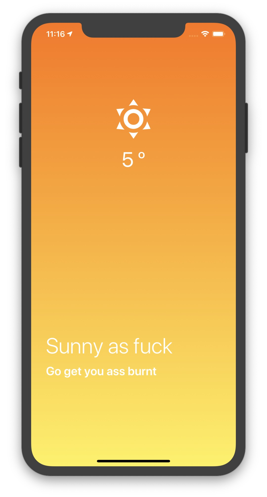
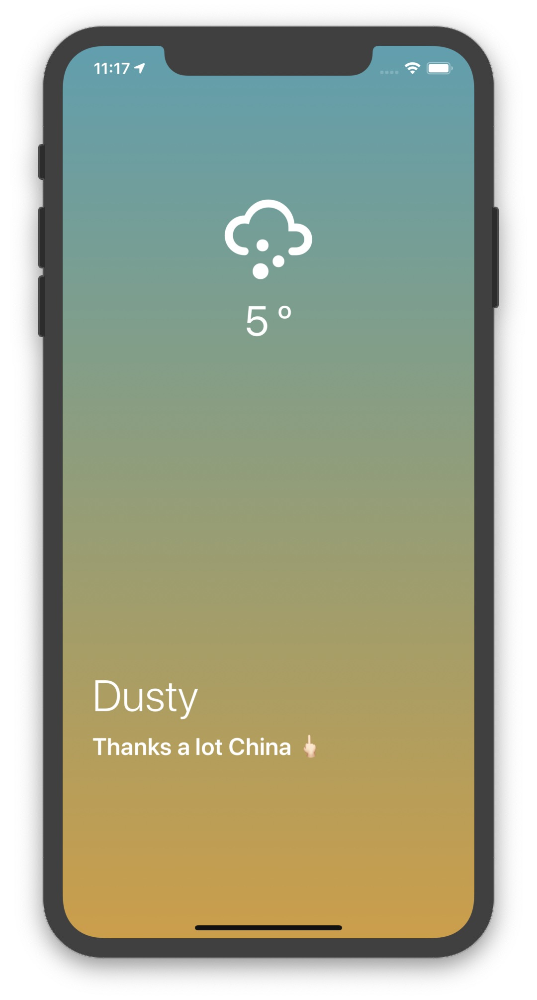
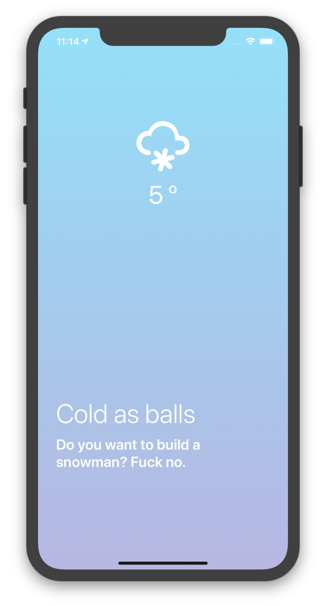
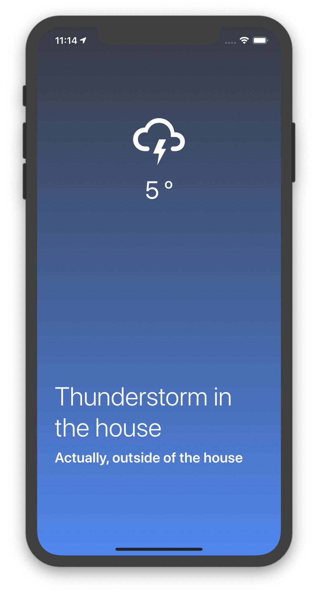

# Weather Application with React Native

|      Clear Weather      |      Cloud Weather      |      Dust Weather      |
| :---------------------: | :---------------------: | :--------------------: |
|  |  |  |

|      Drizzle Weather      |      haze Weather      |      Mist Weather      |
| :-----------------------: | :--------------------: | :--------------------: |
|  |  |  |

|      Rain Weather      |      Snow Weather      |      Thunder Weather      |
| :--------------------: | :--------------------: | :-----------------------: |
|  |  |  |

## Features

- Build and Test with React Native from Expo
- CrossPlatform Application On Android / IOS
- Get a client location and Show the weather there - Location Api by Expo
- Show the weather get from OpenWeather Api - Weather get from [openWeather-Api](https://openweathermap.org)
